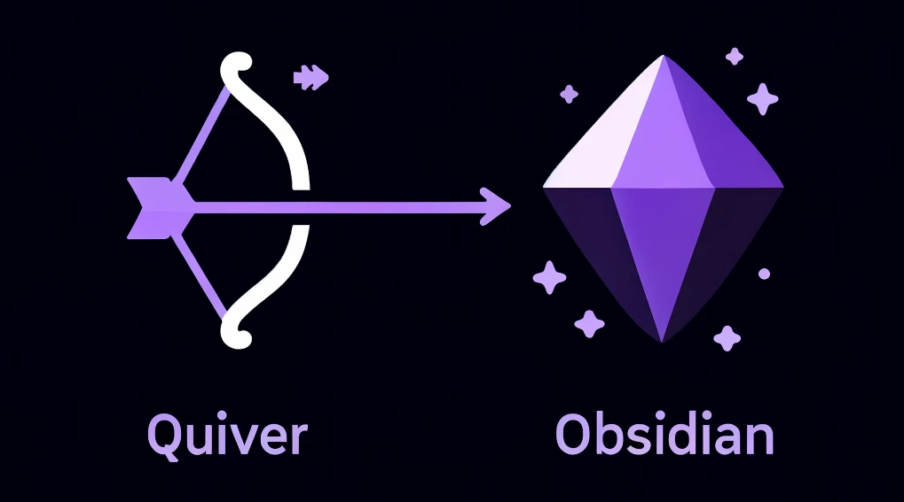
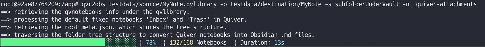

# Export Quiver library to Obsidian markdown files


The original forked repository is ["blue-monk/quiver-to-obsidian-exporter"]( https://github.com/blue-monk/quiver-to-obsidian-exporter), and furthermore the original repository is ["Yukaii/quiver-markdown-exporter"](https://github.com/Yukaii/quiver-markdown-exporter).

This command line tool is built upon the excellent foundation of the original repository.  
Thank you!  

---

This tool facilitates migration from Quiver to Obsidian.  

I made some changes because there were a few points that concerned me when using it (mainly that the number of notes in Quiver didn't match the number of exported markdown files).




* [Quiver](https://yliansoft.com/)
* [Obsidian](https://obsidian.md/)


## Installation

```bash
npm install -g @tettekete/quiver-to-obsidian-exporter
```

## Usage

```bash
Usage
  $ qvr2obs <input.qvlibrary> -o <output folder>  -a <Attachment folder policy>
  or
  $ qvr2obs <input.qvlibrary> -o <output folder>  -a <Attachment folder policy> -n <Attachment subfolder name if needed>

Options
  --output, -o: Output folder
  --attachmentFolderPolicy, -a: Attachment folder policy (vaultFolder, subfolderUnderVault, sameFolderAsEachFile, subfolderUnderEachFolder). 'subfolderUnderVault' and 'subfolderUnderEachFolder' require subfolder name.
  --attachmentSubfolderName, -n: Specify the subfolder name if 'subfolderUnderVault' or 'subfolderUnderEachFolder' is selected as the attachmentFolderPolicy option.

Examples
  $ qvr2obs MyNote.qvlibrary -o dest/MyNote -a vaultFolder
  $ qvr2obs MyNote.qvlibrary -o dest/MyNote -a subfolderUnderVault -n _attachments
```


## Changes from the Original

- Fixed a problem that caused notes with titles beginning with `.` to become hidden files in Obsidian.

- Set `__empty_title__` as a provisional name for a note with an empty title.

- Fixed duplicate title notes to end with `-dup` + number.

- Changed the Properties information assigned to Obsidian content to include `title` information (to avoid the problem of losing the original title due to file name sanitization, making it impossible to search for the original title).
	
	See also ["Properties - Obsidian Help"](https://help.obsidian.md/Editing+and+formatting/Properties)

- The number of notes processed is now displayed as information when the export is complete.

	This is so that you can check if the number of notes matches the number of notes displayed in your Quiver(Trash + All Notes).

	You can also check the number of Markdown files actually exported with commands such as `find testdata/exported -name "*.md" | wc -l`. 


## How to Test (For Developers)

This testing procedure is designed for testing in a clean environment.  
For routine testing, feel free to use your IDE of choice.  

1. Prepare the `testdata` folder:
    In the testdata folder, place xxx.qvlibrary in the sources directory, for example, and also provide a destination folder, etc. and use it as the location for the -o option (-o testdata/destination/MyNote)
2. `yarn run build`.
3. `npm pack`.
4. `docker compose up -d --build`.
5. Enter the Docker container: 
   e.g.
    ```
    docker compose exec app /bin/bash
	```
6.	Execute the command:
	e.g.
	```
	qvr2obs testdata/source/MyNote.qvlibrary -o testdata/destination/MyNote -a subfolderUnderVault -n _attachments
	```

If needed, enable verbose logging for debugging:
```
export QUIVER_TO_OBSIDIAN_EXPORTER_LOGGING_VERBOSE=true
```
This may be set as the value of `QUIVER_TO_OBSIDIAN_EXPORTER_LOGGING_VERBOSE` in `docker-compose.yml`.


Alternatively, you can run the following command after `docker compose up -d --build` without entering the Docker container.

```sh
docker compose exec app qvr2obs testdata/source/MyNote.qvlibrary -o testdata/destination/MyNote -a subfolderUnderVault -n _attachments
```

## Contributing

If you find any bugs or have any suggestions, simply fork this repo and modify it on your own. I would probably not gonna run this repo again. 😝

Also check out the [Quiver Data format Reference](https://github.com/HappenApps/Quiver/wiki/Quiver-Data-Format).

## License

MIT
